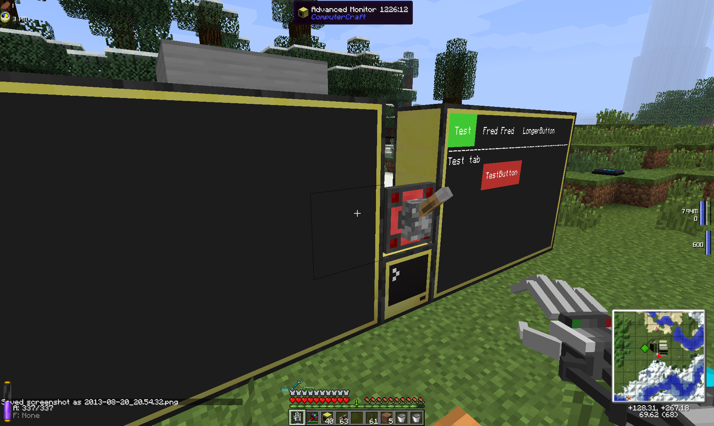

computercraft-things
====================

qid's libraries and programs for <a href="http://www.computercraft.info/">ComputerCraft</a>, a mod for Minecraft.

Tested with ComputerCraft v1.53 for Minecraft v1.5.2.

Note that for all of these files, the .lua extension must be removed if you save them into the ComputerCraft directory.

### Table of Contents
* [libCCClass](#libccclass)
* [libCCEvent](#libccevent)
* [libCCButton](#libccbutton)
* [libCCTabs](#libcctabs)
* [libRCBoiler](#librcboiler)
* [RedstoneDebugger](#redstonedebug)

<a name="libccclass"/>
libCCClass
----------

This is a low-level library that adds some syntactical sugar for defining a "class". Lua doesn't have a first-order
concept of classes, but you can sort of fake it. The code was sourced from
<a href="http://lua-users.org/wiki/SimpleLuaClasses">the Lua Users Wiki</a>, all I did was clean it up a bit.

<a name="libccevent"/>
libCCEvent
----------

This is a unified event-handling library that allows various components to register themselves as handlers for different
types of events. The event handler is passed all of the parameters of the event as provided by ComputerCraft. Handlers
are called in the order in which they register. If an event handler returns `true`, processing of that event ends and
the loop resumes waiting for the next event. If an event handler returns `false`, libCCEvent will continue on with the
list of handlers.

I might see if there's any way to do some sort of threading or coroutines or something that allows processing of
different events to occur simultaneously, so that a blocking event handler can't stop up the whole system. That might be
beyond the scope or capabilities of ComputerCraft.

Note also that the granularity is only by event type at the moment; e.g. you can only register for all redstone events,
not a specific type of redstone event. I'm thinking the best approach would be to create sub-libraries for specific
event types, such as a "libCCEvent-Redstone" that handles all redstone events, but can distinguish between them in more
detail, and then callbacks can be registered with the sub-library. If you then made some pre-made callback templates for
different kinds of operations, you could effectively make an unlimited Programmable Rednet Controller. In theory.

Note: Since libCCEvent simply runs through the list of handlers for each event in order, the order in which handlers are
registered can have a performance impact. The handlers that accept the greatest number or percentage of events should be
listed before the handlers that will run more rarely.

### Periodic Timers
libCCEvent has several built-in periodic timer events that can be subscribed to. They work slightly differently than the
other events: all timer event handlers always get to run, and the return value doesn't have an effect. Currently, the
events are `periodic_timer_1s`, `periodic_timer_5s`, and `periodic_timer_30s`. They're based on a single combined OS
timer every 1 second with a tick count to divide it down for the longer periods. It also uses the `parallel` API to
hopefully be a little more efficient if there are a number of timer handlers. A side effect of this is that no parameters
are passed to a periodic timer event handler.

### ccEvent methods
Method name | Description
------------|------------
`register(event, callback)` | Registers a handler for the given `event`. `callback` should accept the parameters provided by ComputerCraft for `event`, including the event name itself. For example, `monitor_touch` should accept `(event, side, x, y)`
`doEventLoop()` | Begins the event loop. Currently there is no way to exit out.

<a name="libccbutton"/>
libCCButton
-----------

This is an API for ComputerCraft's touch monitors, and is almost entirely lifted from
<a href="https://github.com/chuesler/computercraft-programs">chuesler's computercraft programs</a>. However, I have
modified it to use libCCClass for cleaner syntax, and to use libCCEvent which makes it much easier to combine with
other event handlers.

Buttons can be added to multiple monitors:


Clicking on a button correctly toggles the one on the monitor you clicked on:


And a log of the output from clicking on the button


### Button methods
Method name | Description
------------|------------
`Button`(`text`, `callback`, `xMin`, `xMax`, `yMin`, `yMax`, `colors`, `monitorSide`, `hidden`) | Constructor; creates a new button. Colors is an optional table with keys `text`, `background`, `enabled` and `disabled`. They are all optional and default to `colors.white`, `colors.black`, `colors.lime` and `colors.red`, respectively. MonitorSide specifies the side of the computer that the monitor you want to use is attached to. If left blank, it defaults to the first advanced monitor found. Hidden allows a button to start out not displayed; false or nil makes the button visible, true hides it.
`disable()` | Disables a button. Default is enabled. Note that unlike cheusler's original code, you can click on a disabled button, but not an invisible one.
`display()` | Display the button on screen.
`enable()` | Enables a button. Default is enabled.
`flash(interval)` | Disables the button, waits for the interval, and enables it again. The interval argument is optional and defaults to 0.15s.
`hide()` | Hide the button. Default is visible.
`registerWith(cce)` | Register the button with the specified libCCEvent event handler.
`setMonitor(monitorSide)` | Moves the button to the specified monitor side. Also removes it from the monitor it was previously on.
`show()` | Show the button. Default is visible.
`toggle()` | Toggle the button between enabled and disabled.

### Button attributes
Attribute | Description
----------|------------
`callback` | Callback function, gets called with the button as argument when the button gets clicked.
`colors` | Table with keys `background`, `disabled`, `enabled`, `text`. See the colors API for valid values.
`enabled` | True if the button is enabled. Switches the color used when rendering, can be used by the callback for other uses.
`monitor` | Monitor the button is rendered to. See `setMonitor` above for remarks about multi-monitor use.
`monitorSide` | The side that the monitor is attached to. Note that this *must* match `monitor` above, or things will break. Use `setMonitor`.
`text` | Button text.
`visible` | True if the button is visible. If false, the button cannot be clicked and is not drawn on the screen.
`x` | Table with min/max values on the x axis (horizontal)
`y` | Table with min/max values on the y axis (vertical)

### Combined Demo

Here's an example of how it all fits together:

```lua
os.loadAPI("libccevent")
os.loadAPI("libccbutton")

-- Create a new event handler object
eventHandler = libccevent.ccEvent()

-- First test button: starts on default screen and moves itself to the right
-- screen on first click, toggles state on every click.
testButton = libccbutton.Button("Test", function(button)
		print "Test button clicked!"
		button:setMonitor("right")
		button:toggle()
		return true
	end, 5, 15, 5, 15)

-- Second test button: goes on default screen, toggles every click.
testButton2 = libccbutton.Button("Test2", function(button)
		print "Test2 button clicked!"
		button:toggle()
		return true
	end, 20, 30, 5, 15)

-- Third test button: goes on right screen, toggles every click.
testButtonRight = libccbutton.Button("TestRight", function(button)
		print "TestRight button clicked!"
		button:toggle()
		return true
	end, 20, 30, 5, 15, nil, "right")

-- Register buttons with the event handler.
testButton:registerWith(eventHandler)
testButton2:registerWith(eventHandler)
testButtonRight:registerWith(eventHandler)

-- Let the event handler process all events.
eventHandler:doEventLoop()
```

<a name="libcctabs"/>
libCCTabs
---------

tabbed dialog API

### Tab methods
Method name | Description
------------|------------
`Tabs(monitorSide)` | todo
`addTab(text, callback)` | todo
`getTab(id)` | todo
`selectTab(id)` | todo
`display()` | todo
`registerWith(cce)` | Register the tab dialog with the specified libCCEvent event handler. This must be done after all tabs have been added, and not before.
`setMonitor(monitorSide)` | Moves the tab dialog to the specified monitor side. Also removes it from the monitor it was previously on.

### Tabs demo

The initial screen:


Selecting a different tab:

Note when we switch tabs, the state of the tab's controls is restored.

Switching monitors:

Switching tabs on the new monitor works exactly the same as it did on the first monitor, control state is restored.

```lua
os.loadAPI("libccevent")
os.loadAPI("libccbutton")
os.loadAPI("libcctabs")

eventHandler = libccevent.ccEvent()

tabPanel = libcctabs.Tabs()

-- Create controls for specific tabs
tabTestButton = libccbutton.Button("TestButton", function(button)
		button:toggle()
		if button.enabled then
			tabPanel:setMonitor("left")
		else
			tabPanel:setMonitor("right")
		end
		return true
	end, 10, 22, 6, 8, nil, tabPanel.monitorSide, true)

tabFredButton = libccbutton.Button("FredButton", function(button)
		button:toggle()
		return true
	end, 13, 25, 7, 9, nil, tabPanel.monitorSide, true)

-- Next, add the tabs to the tab panel with the callback functions that render the tab contents
tabPanel:addTab("Test", function (tabs, visible)
	-- Start below the tab border
	tabs.monitor.setCursorPos(1, 5)
	tabs.monitor.write("Test tab")

	-- Ensure that our controls render on the monitor we're actually on
	tabTestButton:setMonitor(tabs.monitorSide)

	-- Display our controls when we're being shown; hide our controls when we're being hidden
	if visible then
		tabTestButton:show()
	else
		tabTestButton:hide()
	end
end)

tabPanel:addTab("Fred Fred", function (tabs, visible)
	tabs.monitor.setCursorPos(1, 5)
	tabs.monitor.write("Fred tab")
	tabFredButton:setMonitor(tabs.monitorSide)
	if visible then
		tabFredButton:show()
	else
		tabFredButton:hide()
	end
end)

tabPanel:addTab("LongerButton", function (tabs, visible)
	tabs.monitor.setCursorPos(1, 5)
	tabs.monitor.write("Longer tab")
end)

-- Finally, register the tab panel and tab-specific controls
tabPanel:registerWith(eventHandler)
tabTestButton:registerWith(eventHandler)
tabFredButton:registerWith(eventHandler)

eventHandler:doEventLoop()
```

<a name="librcboiler"/>
libRCBoiler
-----------

Railcraft boiler monitoring API

<a name="redstonedebug"/>
RedstoneDebugger
----------------

This library is more of a test application/proof of concept than something actually useful, but it shows some of the capabilities
of libCCButton and libCCEvent. Create a RedstoneDebug object (optional parameters are x and y offset and side of the
monitor to display on) and register it with a ccEvent object, and it will draw a button on the screen for every color of
every side. Whenever a redstone signal is toggled on or off, it will update and show the buttons corresponding to every
enabled redstone signal. Useful for attaching a secondary test monitor and showing raw redstone state to see if you got
your cabling correct.

```lua
os.loadAPI("libccevent")
os.loadAPI("redstoneDebug")

eventHandler = libccevent.ccEvent()

-- Offset by 0 along X axis and 10 along Y axis, display on right monitor
rdbg = redstoneDebug.RedstoneDebug(0, 10, "right")
rdbg:registerWith(eventHandler)

eventHandler:doEventLoop()
```